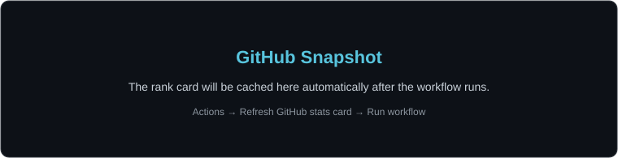

### Software Engineering student at the University of Glasgow

Python tools. Desktop apps. A curiosity for what happens under the hood.

## About Me

I started with **Scratch at eight** and kept building from there. These days, I mostly write Python: cleaning up Windows, automating repetitive jobs, and finding out what my PC is doing.

I like projects I can actually use, take apart, and make better the next time around.

## Technical Toolkit

<table align="center">
<tr>
<td align="center" width="150" height="105">
 
<b>Python</b> Main language
</td>
<td align="center" width="150" height="105">
 
<b>Java</b> Learning
</td>
<td align="center" width="150" height="105">
 
<b>HTML</b>
</td>
<td align="center" width="150" height="105">
 
<b>CSS</b>
</td>
<td align="center" width="150" height="105">
 
<b>MySQL</b> Basics
</td>
</tr>
<tr>
<td align="center" width="150" height="105">
 
<b>Git</b>
</td>
<td align="center" width="150" height="105">
 
<b>GitHub</b>
</td>
<td align="center" width="150" height="105">
 
<b>Linux</b> Learning
</td>
<td align="center" width="150" height="105">
 
<b>VS Code</b>
</td>
<td align="center" width="150" height="105">
 
<b>Windows</b>
</td>
</tr>
</table>

## What I'm Working On

<table align="center">
<tr>
<td width="250" valign="top" align="left">

### 🛠️ Building

**Python tools** that make everyday tasks easier, with cleaner code and better documentation.

</td>
<td width="250" valign="top" align="left">

### 🌱 Learning

**Java & OOP**, alongside algorithms, data structures and databases.

</td>
<td width="250" valign="top" align="left">

### 🔎 Exploring

**Linux & PC hardware**, from command-line tools to the sensors behind a system monitor.

</td>
</tr>
</table>

## Featured Projects

<table align="center">
<tr>
<td width="375" valign="top" align="left">

### Sweepkin

Windows cleaning and optimisation utility built with Python.

`Python` `Windows` `Desktop Tool`

[View repository →](https://github.com/Kieranmcm07/Sweepkin)

</td>
<td width="375" valign="top" align="left">

### DateForge

Terminal-style toolkit for changing file and folder timestamps with dry-run previews.

`Python` `CLI` `File Metadata`

[View repository →](https://github.com/Kieranmcm07/DateForge)

</td>
</tr>
<tr>
<td width="375" valign="top" align="left">

### Nexus Hardware Monitor

PC hardware monitor with live system data, sensors, alerts, history and a compact gaming HUD.

`Python` `Hardware` `Windows / Linux`

[View repository →](https://github.com/Kieranmcm07/Nexus_Hardware_Monitor)

</td>
<td width="375" valign="top" align="left">

### TikTok Downloader

Simple Python CLI for downloading supported TikTok videos and photo slideshows.

`Python` `CLI` `Automation`

[View repository →](https://github.com/Kieranmcm07/TikTok-Downloader)

</td>
</tr>
</table>

**[View all repositories →](https://github.com/Kieranmcm07?tab=repositories)**

## GitHub Snapshot

<picture>
  <source media="(prefers-color-scheme: dark)" srcset="./assets/github-stats-dark.svg" />
  <source media="(prefers-color-scheme: light)" srcset="./assets/github-stats-light.svg" />
  
</picture>

## Contribution Activity

<picture>
  <source media="(prefers-color-scheme: dark)" srcset="https://raw.githubusercontent.com/Kieranmcm07/Kieranmcm07/output/github-contribution-grid-snake-dark.svg" />
  <source media="(prefers-color-scheme: light)" srcset="https://raw.githubusercontent.com/Kieranmcm07/Kieranmcm07/output/github-contribution-grid-snake.svg" />
  
</picture>

Generated automatically from my GitHub contribution graph.

<b>Build. Break. Understand. Improve.</b> 
Always learning. Usually tinkering.

