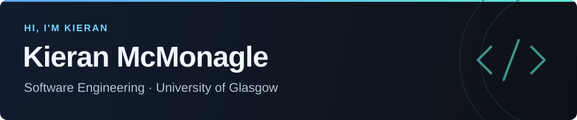

### Software Engineering student at the University of Glasgow

Building practical software, learning how systems work underneath the surface, and improving through projects I can actually use.

## About Me

I'm a Software Engineering student at the **University of Glasgow**. I started programming with Scratch when I was 8, moved into HTML and CSS in high school, and later picked up Python for larger projects and practical tools.

Right now I'm strengthening my foundations in **algorithms, data structures, databases, version control and software design**, while learning **Java** and getting more comfortable with object-oriented programming. Outside coursework, I enjoy Windows tooling, Linux, PC hardware and web projects.

## Technical Toolkit

<table align="center" width="90%">
  <tr>
    <td align="center" width="20%">
       
      <b>Python</b>
    </td>
    <td align="center" width="20%">
       
      <b>Java</b> Learning
    </td>
    <td align="center" width="20%">
       
      <b>HTML</b>
    </td>
    <td align="center" width="20%">
       
      <b>CSS</b>
    </td>
    <td align="center" width="20%">
       
      <b>MySQL</b>
    </td>
  </tr>
  <tr>
    <td align="center" width="20%">
       
      <b>Git</b>
    </td>
    <td align="center" width="20%">
       
      <b>GitHub</b>
    </td>
    <td align="center" width="20%">
       
      <b>Linux</b>
    </td>
    <td align="center" width="20%">
       
      <b>VS Code</b>
    </td>
    <td align="center" width="20%">
       
      <b>Windows</b>
    </td>
  </tr>
</table>

## Current Focus

<table align="center" width="90%">
  <tr>
    <th align="left" width="24%">Area</th>
    <th align="left" width="76%">What I'm working on</th>
  </tr>
  <tr>
    <td><b>University</b></td>
    <td>Strengthening my computer science and software engineering foundations.</td>
  </tr>
  <tr>
    <td><b>Python</b></td>
    <td>Building practical tools, automation and cleaner, more maintainable applications.</td>
  </tr>
  <tr>
    <td><b>Java</b></td>
    <td>Object-oriented programming and second-year coursework.</td>
  </tr>
  <tr>
    <td><b>Core CS</b></td>
    <td>Algorithms, data structures, databases and software design.</td>
  </tr>
  <tr>
    <td><b>Linux</b></td>
    <td>Getting more comfortable with the command line, tooling and development environment.</td>
  </tr>
</table>

## Featured Projects

<table align="center" width="90%">
  <tr>
    <th align="left" width="30%">Project</th>
    <th align="left" width="70%">What it does</th>
  </tr>
  <tr>
    <td><b><a href="https://github.com/Kieranmcm07/Sweepkin">Sweepkin</a></b></td>
    <td>Windows cleaning and optimisation utility built with Python.</td>
  </tr>
  <tr>
    <td><b><a href="https://github.com/Kieranmcm07/DateForge">DateForge</a></b></td>
    <td>Terminal-style Python toolkit for changing file and folder timestamps with dry-run previews.</td>
  </tr>
  <tr>
    <td><b><a href="https://github.com/Kieranmcm07/Nexus_Hardware_Monitor">Nexus Hardware Monitor</a></b></td>
    <td>PC hardware monitor with live system data, sensors, alerts, history and a compact gaming HUD.</td>
  </tr>
  <tr>
    <td><b><a href="https://github.com/Kieranmcm07/TikTok-Downloader">TikTok Downloader</a></b></td>
    <td>Simple Python CLI for downloading supported TikTok videos and photo slideshows.</td>
  </tr>
</table>

<a href="https://github.com/Kieranmcm07?tab=repositories"><b>View all repositories →</b></a>

## GitHub Snapshot

Public GitHub activity snapshot, including the profile rank calculated by GitHub Readme Stats.

## Contribution Activity

<picture>
  <source media="(prefers-color-scheme: dark)" srcset="https://raw.githubusercontent.com/Kieranmcm07/Kieranmcm07/output/github-contribution-grid-snake-dark.svg" />
  <source media="(prefers-color-scheme: light)" srcset="https://raw.githubusercontent.com/Kieranmcm07/Kieranmcm07/output/github-contribution-grid-snake.svg" />
  
</picture>

Generated automatically from my GitHub contribution graph.

## What I'm Building Toward

- Writing readable, maintainable software that solves useful problems.
- Becoming more confident with Java, object-oriented programming and core computer science.
- Improving how I structure, document, test and version my projects.
- Getting more comfortable with Linux and the tools used in real development workflows.

Learning by building, breaking things, fixing them, and making the next version better.

